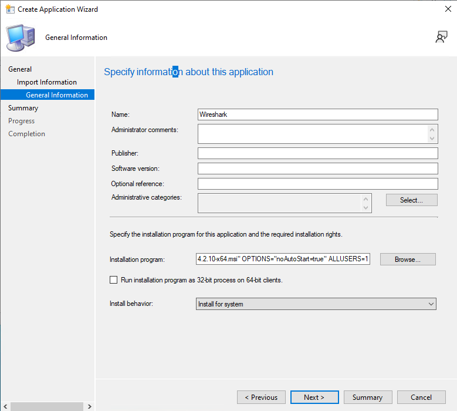

# Installing Applications Using System Configuration Manager

1. Getting the apps or app that you would like to install
Make sure that the package that you try to use for deployment is .msi, .appx, .appxbundle, .msix, .msixbundle. Or convert your exe to one of the app extensions that I had listed.

I am going to be using wireshark for my example.

2. Make a folder that you will share on the network.

3. Right click on the folder that you just created and select properties.

4. Click on Share

5. Copy the msi file to the network share folder

6. In the network access click on share. Then click done

7. Opening Configuration Manager Console
You will now want to navigate to your search bar and search for Configuration Manager Console and open it.

There will be a windows that pops up and will have a dahsbaord like interface on it.

8. In the bottom left of Configuration Manager Console click on software libary.

9. Right click on applications and select create application.

10. Browse to the application that is in your network share folder. then click next.

11. Next again on the general information.

12. Set the installation Properties for the install in general information. The next option you can just click next on. Then close.

13. Right click on the new application and select Distribute Content.

14. In the Content Destination click on the add button. And select Distibution Point

15. Select the server that you are going to deploy from. Then Click Ok then next

16. On the Deployment setting page set the purpose to install.

17. In the summary click next. The Close on the completion.

18. Right click on the application and select deploy.

19. In the General settings select the browse next to collection.

20. Now you will select the users that will have access to the deployment. I'm going to deploy to all users. Then click Ok and then next.

21. In content select next, Deployment settings select next, In scheduling you can specify when the application can be made available for me I'm not going to set that then click next. User experience click next. Alerts click next if you dont need them. On summary click next then close.

22. You will then want to login to a user in the domain on a client machine.

23. Open control panel and go to system and security.

24. You will then want to go to configuration manager at the bottom of the page

25. you will want to select the **Actions** tab then select **Machine Policy Retrieval & Evaluation Cycle**. Then once selected click run now.

26. On the bottom right of your screen you will get a notification saying that you IT department requires changes to the device.

27. The application will automatically download and install in the background once it is done it will have a notification that will pop up in the lower right hand corner saying that it finished downloading and installing.

28. Now you can launch the app and use it.

